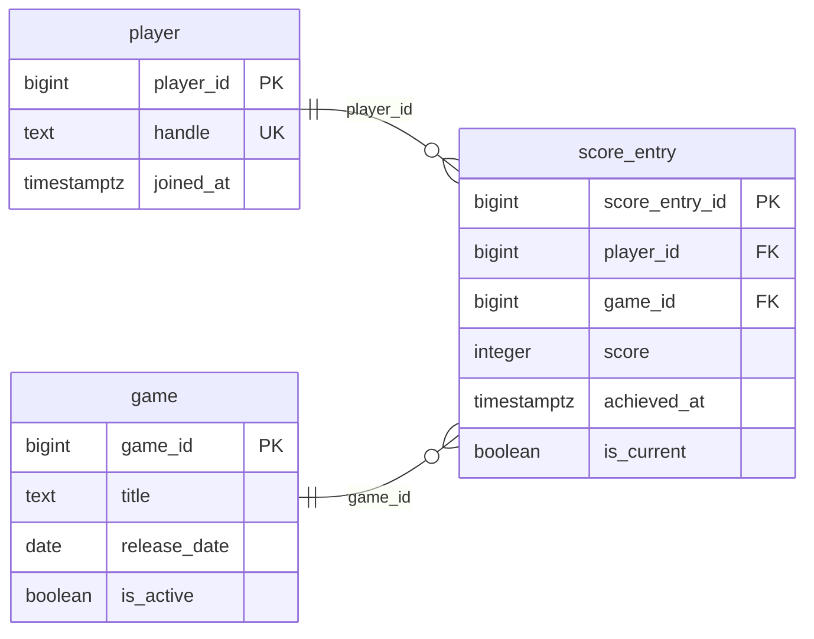

# Real-time Game Leaderboard — ER diagram

```mermaid
erDiagram
    direction LR
    player {
        bigint player_id PK
        text handle UK
        timestamptz joined_at
    }
    game {
        bigint game_id PK
        text title
        date release_date
        boolean is_active
    }
    score_entry {
        bigint score_entry_id PK
        bigint player_id FK
        bigint game_id FK
        integer score
        timestamptz achieved_at
        boolean is_current
    }
    player ||--o{ score_entry : "player_id"
    game ||--o{ score_entry : "game_id"
```
